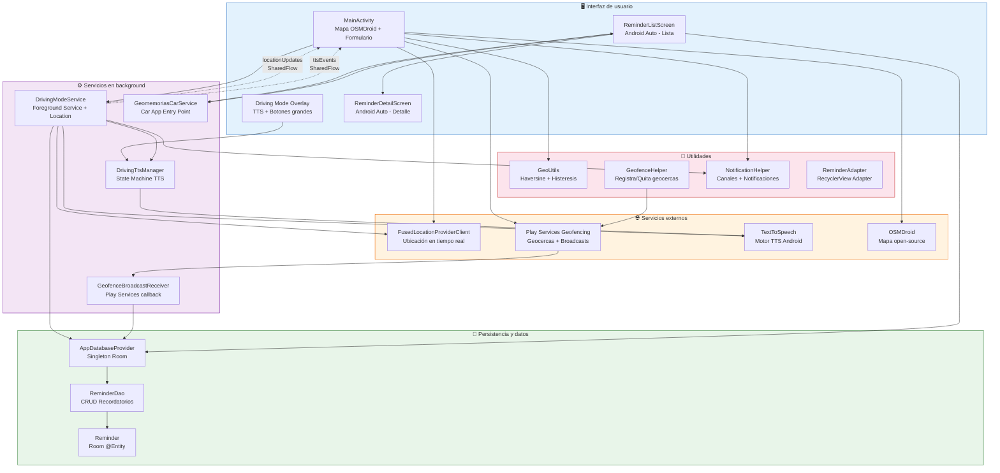
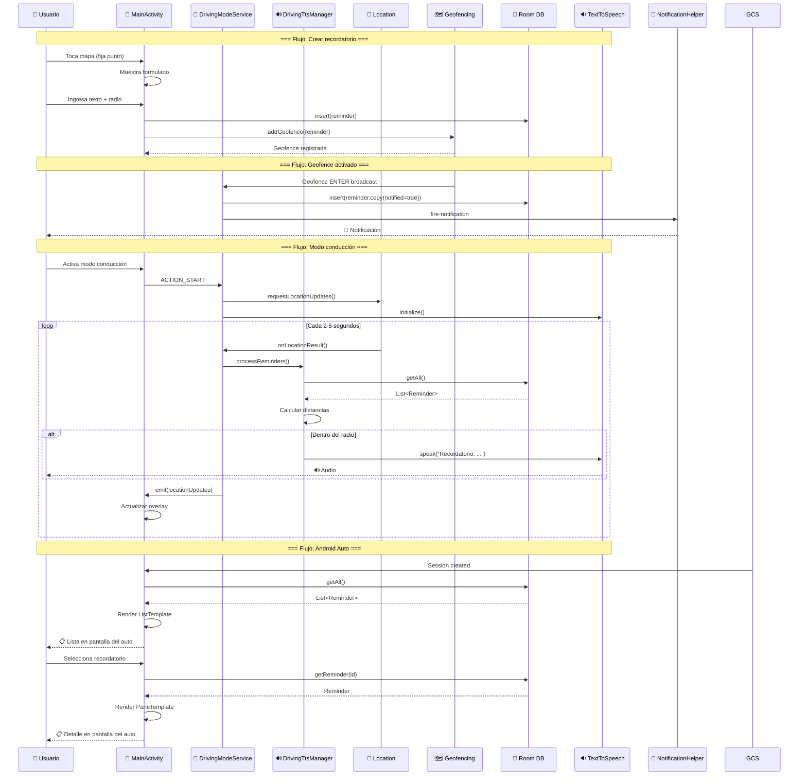
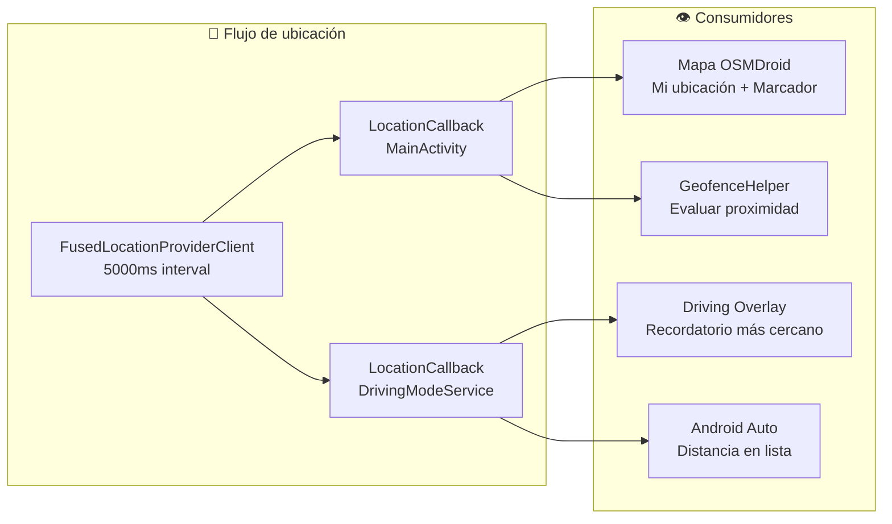
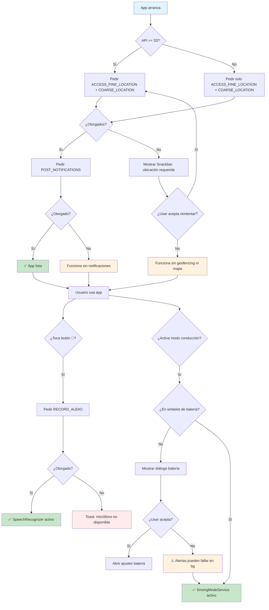
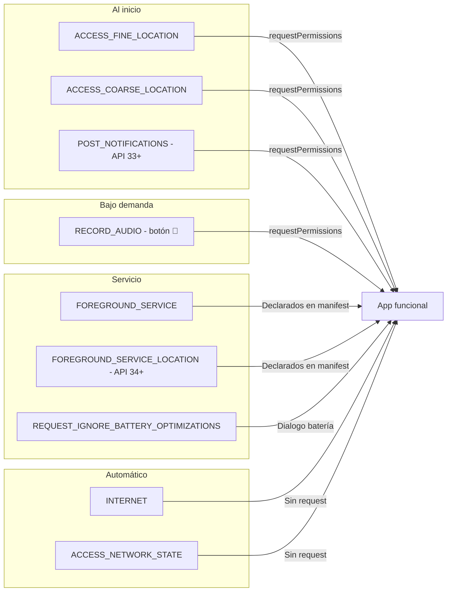
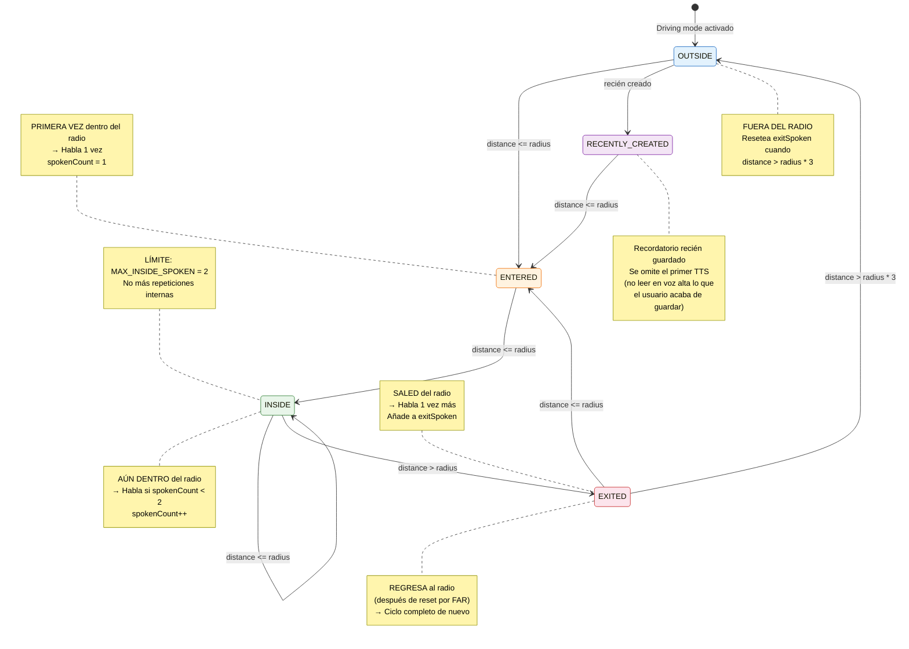
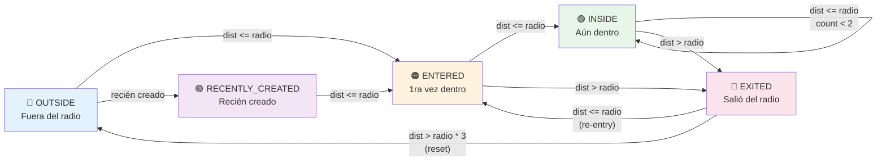

# BRIEF.md — geomemorias2 (Android)

Plantilla para pedir features (igual filosofía que la v1 web).

```text
¿QUÉ:           <resultado visible final>
REGLA LADO/POS:  <dónde en la UI>
CUÁNDO OCULTAR:  <qué pasa si la app está en bg, si no hay permiso, etc.>
EXCEPCIÓN:       <qué SIEMPRE queda igual>
NO:              <qué NUNCA debe pasar>
VERIFICACIÓN:    <cómo sabes que está bien (en tu dispositivo Android 9+)>
```

## Regla de oro (heredada de v1)
El recordatorio YA EXISTE. La app valida proximidad (distancia <= radioM) y
notifica; NO crea nada al chequear. El "crear" es captura (texto+coords+radio).

## Diferencia clave vs v1 web
- v1 web: polling adaptativo + Service Worker (no despierta en bg real).
- v2 Android: Geofencing API de Play Services DESPIERTA la app al cruzar el
  radio, aunque esté cerrada. Esto es la "proactividad real" que la v1 no tenía.

## Recuerda al agente
- minSdk 28 (Android 9). No uses APIs > 28 sin guard con version.
- Pedir permisos al iniciar (ubicación + POST_NOTIFICATIONS en API 33+).
- Persistencia device-only (Room), sin nube.
- Tras entregar, retroalimenta cómo pedir lo mismo más directo.
- Mantener to_do.txt al día.

---

## Arquitectura del sistema

### Diagrama de componentes



### Diagrama de flujo de datos



### Flujo de ubicación



### Flujo de persistencia

```mermaid
flowchart TB
    subgraph Operations["📝 Operaciones CRUD"]
        CREATE[Crear<br/>texto+coords+radio]
        READ[Leer<br/>getAll, getById]
        UPDATE[Actualizar<br/>notified flag]
        DELETE[Eliminar<br/>delete, deleteById]
    end

    subgraph Storage["💾 Capa de persistencia"]
        RD[ReminderDao<br/>Room DAO]
        APD[AppDatabaseProvider<br/>Singleton]
        R[Reminder<br/>Room @Entity]
    end

    subgraph Consumers["🔍 Consumidores"]
        MA[MainActivity<br/>Lista + Geofence]
        DMS[DrivingModeService<br/>TTS alerts]
        GBR[GeofenceBroadcastReceiver<br/>notified flag]
        RLS[ReminderListScreen<br/>Android Auto]
    end

    CREATE --> RD
    READ --> RD
    UPDATE --> RD
    DELETE --> RD
    RD --> APD
    APD --> R

    MA -->|insert, getAll, delete| RD
    DMS -->|getAll| RD
    GBR -->|insert (update notified)| RD
    RLS -->|getAll| RD
```

---

## Permisos requeridos

La app declara los siguientes permisos en `AndroidManifest.xml`:

### Permisos de ubicación
| Permiso | Cuándo se pide | Para qué sirve |
|---------|----------------|----------------|
| `ACCESS_FINE_LOCATION` | Al iniciar la app (requestPermissions) | Geofencing (Play Services), mapa OSMDroid, ubicación actual |
| `ACCESS_COARSE_LOCATION` | Junto con FINE_LOCATION | Ubicación aproximada (fallback si GPS no disponible) |

### Permisos de notificaciones
| Permiso | Cuándo se pide | Para qué sirve |
|---------|----------------|----------------|
| `POST_NOTIFICATIONS` | Solo en Android 13+ (API 33+), al iniciar | Notificaciones de geofence y modo conducción |

> **Nota:** En Android 12 o anterior, este permiso se otorga automáticamente.
> Se verifica con `shouldShowRequestPermissionRationale()` para mostrar
> explicación al usuario si lo deniega.

### Permisos de audio
| Permiso | Cuándo se pide | Para qué sirve |
|---------|----------------|----------------|
| `RECORD_AUDIO` | Al usar comando de voz (botón 🎤) | SpeechRecognizer para captura por voz |

> **Nota:** Se pide bajo demanda (no al inicio) para no asustar al usuario.
> Se lanza con `permLauncher.launch(arrayOf(Manifest.permission.RECORD_AUDIO))`.

### Permisos de red
| Permiso | Cuándo se pide | Para qué sirve |
|---------|----------------|----------------|
| `INTERNET` | Automático (declarado en manifest) | Descargar tiles del mapa OSMDroid |
| `ACCESS_NETWORK_STATE` | Automático (declarado en manifest) | Verificar conectividad antes de descargar tiles |

### Permisos de servicio en primer plano
| Permiso | Cuándo se pide | Para qué sirve |
|---------|----------------|----------------|
| `FOREGROUND_SERVICE` | Automático (API 28+) | Ejecutar DrivingModeService en background |
| `FOREGROUND_SERVICE_LOCATION` | Automático (API 34+) | Tipo de foreground service para ubicación |

> **Nota:** `FOREGROUND_SERVICE_LOCATION` es obligatorio desde API 34.
> Se declara en manifest sin necesidad de request.

### Permisos de batería
| Permiso | Cuándo se pide | Para qué sirve |
|---------|----------------|----------------|
| `REQUEST_IGNORE_BATTERY_OPTIMIZATIONS` | Al activar modo conducción (si no está en whitelist) | Solicitar exención de optimización de batería |

> **Nota:** Google Play rechaza apps que pidan este permiso sin justificación.
> Se muestra diálogo explicativo antes de lanzar el intent.

### Flujo de permisos



#### Diagrama simplificado



### Manejo de denegación
- Si el usuario deniega `ACCESS_FINE_LOCATION`: la app no puede geofencing ni mapa.
  Se muestra Snackbar con explicación y opción de reintentar.
- Si el usuario deniega `POST_NOTIFICATIONS`: no habrá notificaciones de geofence.
  La app funciona pero sin alertas.
- Si el usuario deniega `RECORD_AUDIO`: el botón 🎤 no funciona.
  Se muestra Toast informativo.

### Verificación en código
```kotlin
// Verificar permiso de ubicación
if (ContextCompat.checkSelfPermission(this, Manifest.permission.ACCESS_FINE_LOCATION)
    != PackageManager.PERMISSION_GRANTED) {
    permLauncher.launch(arrayOf(Manifest.permission.ACCESS_FINE_LOCATION))
}

// Verificar permiso de notificaciones (API 33+)
if (Build.VERSION.SDK_INT >= Build.VERSION_CODES.TIRAMISU) {
    perms.add(Manifest.permission.POST_NOTIFICATIONS)
}

// Verificar permiso de audio
fun hasAudioPermission(): Boolean {
    return ContextCompat.checkSelfPermission(this, Manifest.permission.RECORD_AUDIO) ==
        PackageManager.PERMISSION_GRANTED
}
```

### Geofencing sin permiso explícito
Play Services maneja los broadcasts de geofence internamente.
No se requiere permiso extra más allá de `ACCESS_FINE_LOCATION`.
El `GeofenceBroadcastReceiver` recibe `ACTION_GEOFENCE` cuando el usuario
cruza el radio, incluso si la app está cerrada.

---

## Modo Conducción (Driving Mode)

### ¿Qué es?
Overlay sobre el mapa que se activa cuando el usuario conduce. Muestra
recordatorios cercanos por TTS (TextToSpeech) mientras el teléfono está
en segundo plano. Diseñado para ser usable sin mirar la pantalla.

### Componentes
- **DrivingModeService** — Foreground Service que mantiene ubicación + TTS
  corriendo en background. Requiere notificación persistente (Android 8+).
  - Acciones: `ACTION_START` / `ACTION_STOP`
  - Publica ubicación vía `SharedFlow` → MainActivity observa
  - Publica eventos TTS vía `SharedFlow` → UI actualiza si visible
  - Lifecycle: `START_STICKY` (el SO lo re-inicia si muere)

- **DrivingTtsManager** — Controlador TTS centralizado con state machine:
  - `ENTER` → habla 1 vez
  - `INSIDE` → habla hasta 2 veces (MAX_INSIDE_SPOKEN)
  - `EXIT` → habla 1 vez más
  - `FAR` (>3x radio) → resetea para permitir re-aviso al regresar
  - Suprime TTS para recordatorios recién creados (no leer en voz alta
    lo que el usuario acaba de guardar)

#### Diagrama de estado del TTS



#### Diagrama simplificado del ciclo de vida



#### Tabla de transiciones

| Estado actual | Condición | Acción | Estado siguiente |
|---------------|-----------|--------|------------------|
| OUTSIDE | `distance <= radius` | `spokenCount = 1`, hablar 1 vez | ENTERED |
| OUTSIDE | `recién creado` | Solo trackear, sin hablar | RECENTLY_CREATED |
| RECENTLY_CREATED | `distance <= radius` | Trackear entry silenciosamente | ENTERED |
| ENTERED | `distance <= radius` | `spokenCount++`, hablar | INSIDE |
| INSIDE | `distance <= radius` y `count < 2` | `spokenCount++`, hablar | INSIDE |
| INSIDE | `distance <= radius` y `count >= 2` | No hablar (límite alcanzado) | INSIDE |
| INSIDE | `distance > radius` | Hablar 1 vez, añadir a `exitSpoken` | EXITED |
| EXITED | `distance > radius * 3` | Eliminar de `exitSpoken` (reset) | OUTSIDE |
| EXITED | `distance <= radius` | Reiniciar ciclo | ENTERED |

#### Variables de estado

| Variable | Tipo | Propósito |
|----------|------|-----------|
| `insideReminders` | `MutableSet<String>` | IDs de recordatorios actualmente dentro del radio |
| `spokenCount` | `MutableMap<String, Int>` | Veces que se habló cada recordatorio mientras estuvo dentro |
| `exitSpoken` | `MutableSet<String>` | IDs que ya se hablaron al salir (evita repetir) |
| `recentlyCreatedIds` | `MutableSet<String>` | IDs de recordatorios recién creados (suprimir 1er TTS) |

#### Constantes

| Constante | Valor | Propósito |
|-----------|-------|-----------|
| `MAX_INSIDE_SPOKEN` | `2` | Máximo de veces que se habla mientras estás dentro del radio |
| `EXIT_DISTANCE_MULTIPLIER` | `3.0` | Multiplicador para resetear el flag de exit (distance > radius * 3) |

### Funcionalidades
- Overlay con fondo **TRANSPARENTE** (el mapa se ve detrás)
- Barra superior: recordatorio más cercano + radio + distancia
- Barra inferior con 2 botones grandes (64dp, fácil de tocar):
  - 🎤 **Hablar**: graba voz → auto-guarda en ubicación actual
  - 📌 **Fijar punto**: guarda ubicación actual con texto por defecto
- Indicador de voz: spinner azul + "🎤 Di tu recordatorio…"
- Botón salir rojo pequeño
- Mapa interactivo visible (zoom, pan, markers)
- isDrivingVoiceMode flag para distinguir grabación voz normal vs conducción
- saveDrivingModeReminder() delega a saveVoiceReminder() para reutilizar
- speechLauncher maneja resultados de voz en modo conducción
- enterDrivingMode()/exitDrivingMode() muestran/ocultan wrapper + overlay
- Validación de texto vacío: Snackbar + TextInputLayout.setError()

### Notificación persistente
- Canal: `DRIVING_CHANNEL_ID` (IMPORTANCE_LOW, sin sonido)
- Icono: `ic_dialog_map`
- Acción "Detener" → envía ACTION_STOP al servicio
- Tap → abre MainActivity con action `RESUME_DRIVING_MODE`

### Verificación de batería
- Al activar modo conducción, verifica si la app está en whitelist
  de batería optimizada. Si no, muestra diálogo advirtiendo que las
  alertas podrían detenerse al bloquear pantalla. Opción de abrir
  ajustes de batería.

---

## Android Auto

### ¿Qué es?
Integración con Android Auto usando la **Car App Library** (Opción 1).
Muestra los recordatorios en la pantalla del auto mientras se conduce.
Requiere que el usuario tenga Android Auto instalado y conectado.

### Componentes
- **GeomemoriasCarService** — Entry point (`CarAppService`)
  - `createHostValidator()`: ALLOW_ALL_HOSTS_VALIDATOR (para pruebas)
  - `onCreateSession()`: retorna Session con ReminderListScreen
  - Requiere en AndroidManifest:
    ```xml
    <service android:name=".GeomemoriasCarService" android:exported="true">
      <intent-filter>
        <action android:name="androidx.car.app.CarAppService" />
      </intent-filter>
    </service>
    ```

- **ReminderListScreen** — Pantalla principal (ListTemplate)
  - Lista de recordatorios con `SectionedItemList`
  - Cada fila: título + radio + distancia en tiempo real
  - Auto-refresh cada 10s (lifecycleScope + repeatOnLifecycle)
  - Botón 🔄 para refresh manual
  - Click → navega a `ReminderDetailScreen`
  - Maneja caso de lista vacía con mensaje informativo

- **ReminderDetailScreen** — Detalle del recordatorio (PaneTemplate)
  - Fila 1: Texto + radio
  - Fila 2: Coordenadas exactas (lat, lng)
  - Fila 3: Estado de notificación (Sí/No)
  - Header con Action.BACK para volver a la lista

### Funcionalidades
- Lista con distancia en tiempo real (actualización cada 10s)
- Navegación entre pantallas (lista → detalle → volver)
- Refresh automático cuando se crea/borra un recordatorio en el teléfono
- Diseño cumpliendo directrices de Android Auto:
  - Texto grande y de alto contraste
  - Mínimo 3-4 items visibles
  - Sin interacciones complejas
  - Actualizaciones no más de 1 vez por segundo

### Dependencia
```gradle
implementation "androidx.car.app:app:1.4.0"
```

### Strings específicos para Auto
- `car_list_title` — título de la lista
- `car_empty_list` — mensaje cuando no hay recordatorios
- `car_no_distance` — texto cuando no hay ubicación conocida
- `car_radius` / `car_distance` — formato para radio y distancia
- `car_detail_radius` / `car_detail_coords` / `car_detail_notification`

### Verificación
- Conectar dispositivo con Android Auto (físico o DHU)
- Abrir Geomemorias → verificar que la lista aparece
- Crear/borrar recordatorio en el teléfono → verificar que se actualiza
- Navegar a detalle → verificar que muestra info correcta
- Volver a lista → verificar que el back funciona

### Pendiente (Opción 2: Notificaciones automáticas)
- Meta-data en AndroidManifest: `com.google.android.gms.car.notification = true`
- NotificationHelper con `CATEGORY_NAVIGATION` + `BigTextStyle`
- Ícono propio visible en display del auto
- Probar notificaciones reales en Android Auto
